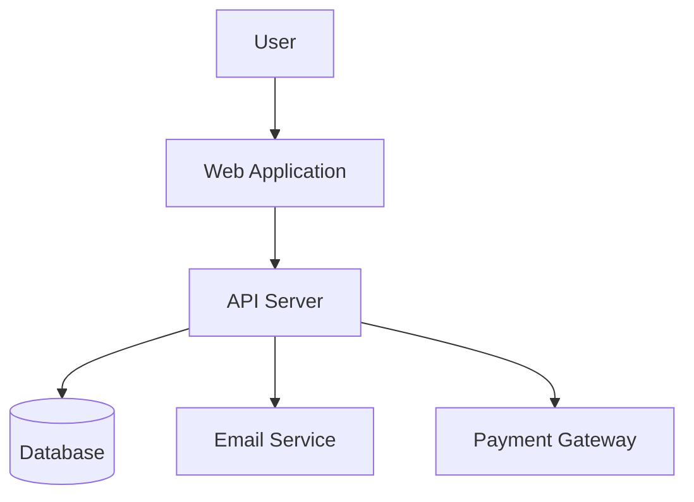
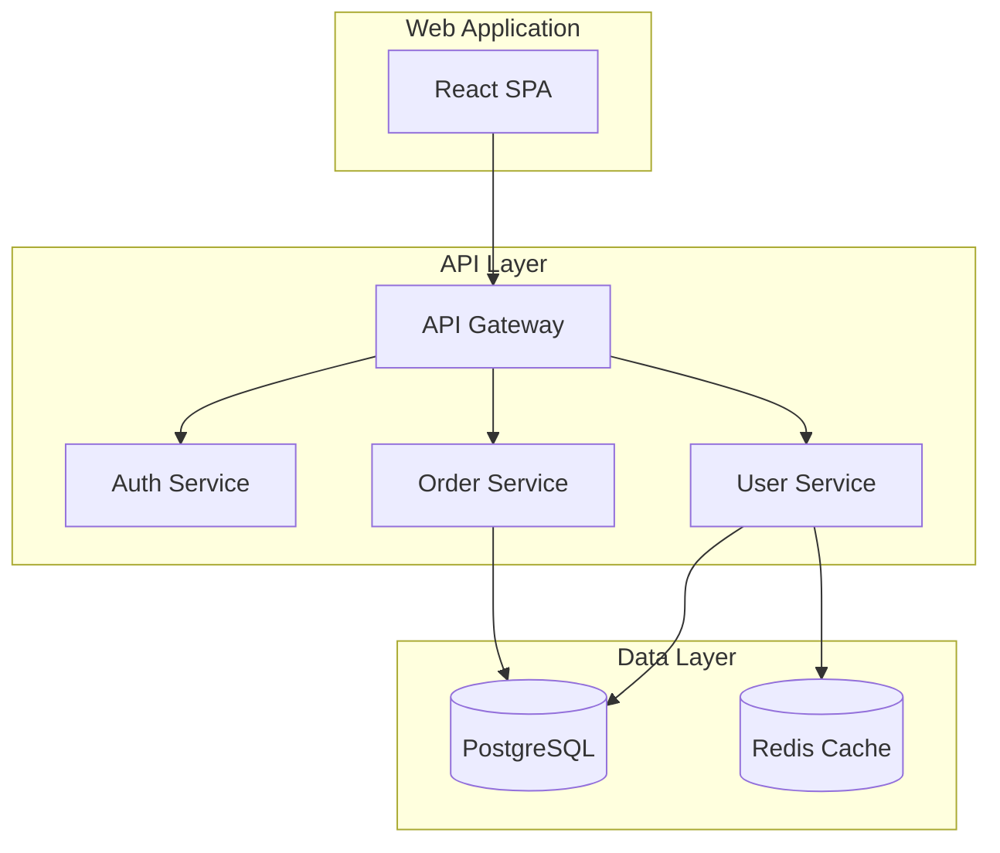

# Documentation Skill

> Etkili teknik dokümantasyon yazma rehberi.
> Docs-as-code yaklaşımı, API documentation ve maintainable docs.

---

# 📋 İçindekiler

1. [Dokümantasyon Tipleri](#1-dokümantasyon-tipleri)
2. [README Best Practices](#2-readme-best-practices)
3. [Code Documentation](#3-code-documentation)
4. [API Documentation](#4-api-documentation)
5. [Changelog](#5-changelog)
6. [Architecture Documentation](#6-architecture-documentation)
7. [Writing Guidelines](#7-writing-guidelines)
8. [Kontrol Listesi](#8-kontrol-listesi)
9. [Yapma Listesi](#9-yapma-listesi)
10. [Mutlaka Yap Listesi](#10-mutlaka-yap-listesi)

---

# 1. Dokümantasyon Tipleri

| Tip | Hedef Kitle | Amaç |
|-----|-------------|------|
| **README** | İlk kez görenler | Quick start, genel bakış |
| **API Docs** | Geliştiriciler | Endpoint kullanımı |
| **Code Comments** | Bakım yapan | Why, not what |
| **Architecture** | Takım | Sistem tasarımı |
| **Changelog** | Kullanıcılar | Değişiklik takibi |
| **Runbook** | Ops/SRE | Operasyonel prosedürler |

---

# 2. README Best Practices

## 2.1 README Template

```markdown
# Project Name

> Tek cümleyle projenin ne yaptığını açıkla.


## Features

- ✅ Feature 1
- ✅ Feature 2
- ✅ Feature 3

## Quick Start

### Prerequisites

- Node.js 20+
- npm 10+

### Installation

```bash
npm install
cp .env.example .env
npm run dev
```

### Usage

```typescript
import { myFunction } from 'my-package';

const result = myFunction({ option: 'value' });
```

## Documentation

- [API Reference](./docs/api.md)
- [Architecture](./docs/architecture.md)
- [Contributing](./CONTRIBUTING.md)

## License

MIT © [Your Name](https://github.com/yourusername)
```

## 2.2 README Kuralları

| Kural | Açıklama |
|-------|----------|
| **Başlık açık olmalı** | Ne olduğu hemen anlaşılmalı |
| **Quick start kısa** | 5 dakikada çalıştırabilmeli |
| **Copy-paste ready** | Kod blokları doğrudan çalışmalı |
| **Görsel kullan** | Badge, screenshot, diagram |
| **Güncel tut** | Eski bilgi yok |

---

# 3. Code Documentation

## 3.1 JSDoc/TSDoc

```typescript
/**
 * Calculates the total price including tax.
 * 
 * @param amount - The base amount before tax
 * @param taxRate - Tax rate as a decimal (e.g., 0.18 for 18%)
 * @returns The total amount including tax
 * 
 * @example
 * ```ts
 * const total = calculateTotal(100, 0.18);
 * console.log(total); // 118
 * ```
 * 
 * @throws {Error} If amount is negative
 * @since 1.2.0
 */
function calculateTotal(amount: number, taxRate: number): number {
  if (amount < 0) {
    throw new Error('Amount cannot be negative');
  }
  return amount * (1 + taxRate);
}
```

## 3.2 Comment Best Practices

```typescript
// ❌ YANLIŞ: What (kod zaten söylüyor)
// Increment counter by 1
counter++;

// ❌ YANLIŞ: Obvious
// Loop through users
for (const user of users) { }

// ✅ DOĞRU: Why (neden böyle yapıldığını açıklıyor)
// Using setTimeout to debounce frequent updates and prevent
// overwhelming the API with requests during rapid user input
setTimeout(() => saveChanges(), 500);

// ✅ DOĞRU: Business logic
// Premium users get 20% discount on orders over $100
// as per marketing campaign agreement (JIRA-1234)
if (user.isPremium && order.total > 100) {
  discount = 0.20;
}

// ✅ DOĞRU: Warning
// ⚠️ Do not change the order of these middleware!
// Authentication must run before authorization
app.use(authenticate);
app.use(authorize);

// ✅ DOĞRU: TODO with context
// TODO(john): Refactor after Q1 release - JIRA-5678
// Current implementation handles edge case but is O(n²)
```

---

# 4. API Documentation

## 4.1 OpenAPI/Swagger

```yaml
# openapi.yaml
openapi: 3.0.3
info:
  title: User Management API
  version: 1.0.0
  description: API for managing users

paths:
  /users:
    get:
      summary: List all users
      tags:
        - Users
      parameters:
        - name: page
          in: query
          schema:
            type: integer
            default: 1
        - name: limit
          in: query
          schema:
            type: integer
            default: 10
      responses:
        '200':
          description: Successful response
          content:
            application/json:
              schema:
                type: object
                properties:
                  success:
                    type: boolean
                  data:
                    type: array
                    items:
                      $ref: '#/components/schemas/User'
                  meta:
                    $ref: '#/components/schemas/Pagination'

components:
  schemas:
    User:
      type: object
      properties:
        id:
          type: string
          format: uuid
        email:
          type: string
          format: email
        name:
          type: string
      required:
        - id
        - email
```

## 4.2 API Doc Template

```markdown
## Create User

Creates a new user account.

### Endpoint

`POST /api/v1/users`

### Request

#### Headers

| Header | Value | Required |
|--------|-------|----------|
| Content-Type | application/json | Yes |
| Authorization | Bearer {token} | Yes |

#### Body

```json
{
  "email": "user@example.com",
  "password": "SecurePass123!",
  "name": "John Doe"
}
```

#### Parameters

| Field | Type | Required | Description |
|-------|------|----------|-------------|
| email | string | Yes | Valid email address |
| password | string | Yes | Min 8 chars, 1 uppercase, 1 number |
| name | string | Yes | 2-100 characters |

### Response

#### Success (201)

```json
{
  "success": true,
  "data": {
    "id": "123e4567-e89b-12d3-a456-426614174000",
    "email": "user@example.com",
    "name": "John Doe",
    "createdAt": "2025-01-15T10:30:00Z"
  }
}
```

#### Error (400)

```json
{
  "success": false,
  "error": {
    "code": "VALIDATION_ERROR",
    "message": "Invalid email format"
  }
}
```
```

---

# 5. Changelog

## 5.1 Keep a Changelog Format

```markdown
# Changelog

All notable changes to this project will be documented in this file.

The format is based on [Keep a Changelog](https://keepachangelog.com/),
and this project adheres to [Semantic Versioning](https://semver.org/).

## [Unreleased]

### Added
- New user profile page

### Changed
- Improved loading performance

## [1.2.0] - 2025-01-15

### Added
- OAuth2 authentication support
- Dark mode toggle

### Changed
- Updated dashboard layout
- Improved error messages

### Fixed
- Login button not responding on mobile
- Memory leak in real-time updates

### Security
- Patched XSS vulnerability in comments
```

## 5.2 Conventional Commits

```bash
# Format: <type>(<scope>): <description>

feat(auth): add Google OAuth support
fix(api): handle null response from external service
docs(readme): add installation instructions
refactor(utils): simplify date formatting logic
test(user): add unit tests for user service
chore(deps): update dependencies
perf(query): optimize database queries

# Breaking change
feat(api)!: change response format for user endpoint

BREAKING CHANGE: The user endpoint now returns data wrapped in a 'data' object.
Before: { id, name, email }
After: { success: true, data: { id, name, email } }
```

---

# 6. Architecture Documentation

## 6.1 C4 Model

```markdown
## System Context (Level 1)



## Container Diagram (Level 2)


```

## 6.2 Architecture Decision Records (ADR)

```markdown
# ADR-002: API Authentication

## Status
Accepted

## Context
We need to authenticate API requests from our mobile and web clients.

## Decision
We will use JWT tokens for authentication with refresh token rotation.

## Consequences

### Positive
- Stateless authentication
- Easy to scale
- Works across services

### Negative
- Token revocation is complex
- Larger request payload
```

---

# 7. Writing Guidelines

## 7.1 Audience-First Writing

```markdown
## Target Audience Analysis

### Beginners
- Assume no prior knowledge
- Explain every step
- Provide screenshots
- Link to prerequisites

### Intermediate
- Assume basic knowledge
- Focus on implementation
- Provide code examples
- Link to advanced topics

### Experts
- Assume full context
- Focus on edge cases
- Provide benchmarks
- Link to source code
```

## 7.2 Style Guide

| Do | Don't |
|----|-------|
| Use active voice | Use passive voice |
| Keep sentences short | Write long paragraphs |
| Use numbered lists for steps | Use prose for instructions |
| Show, don't just tell | Only describe without examples |
| Update regularly | Leave outdated content |

---

# 8. Kontrol Listesi

### README
- [ ] Tek cümlelik açıklama
- [ ] Quick start çalışıyor
- [ ] Kod örnekleri test edildi
- [ ] Link'ler çalışıyor
- [ ] Badge'ler güncel

### API Docs
- [ ] Tüm endpoint'ler belgelendi
- [ ] Request/response örnekleri var
- [ ] Error codes açıklandı
- [ ] Authentication açıklandı
- [ ] cURL örnekleri var

### Code Comments
- [ ] Why açıklanmış, what değil
- [ ] Business logic belgelendi
- [ ] Edge cases açıklandı
- [ ] TODO'lar context içeriyor

---

# 9. Yapma Listesi

❌ Obvious comment'ler yazma
❌ Güncellemeden bırakma
❌ Jargon kullanma (açıkla)
❌ Tek seferlik yazıp unutma
❌ Sadece happy path'i belgele

---

# 10. Mutlaka Yap Listesi

✅ README ile başla
✅ API'yi OpenAPI ile belgele
✅ Code'da "why" açıkla
✅ Changelog tut
✅ ADR yaz
✅ Düzenli güncelle
✅ Örnekler ver
✅ Test et (dokümandaki kod çalışmalı)

---

**Son Güncelleme:** Aralık 2025
**Versiyon:** 2.0
