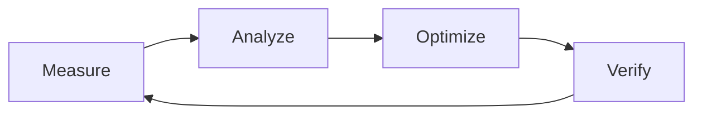

# Optimization Skill - System & Flow Optimization

> Methodology to bring software systems and user flows to peak performance and efficiency.
> 2025 AI-assisted observability and systematic improvement techniques.

---

# 📋 Contents

1. [Optimization Principles (2025)](#1-optimization-principles-2025)
2. [Bottleneck Identification](#2-bottleneck-identification)
3. [AI-Driven Optimization](#3-ai-driven-optimization)
4. [Modern Observability](#4-modern-observability)
5. [Frontend & User Experience Optimization](#5-frontend--user-experience-optimization)
6. [Backend & Database Optimization](#6-backend--database-optimization)
7. [Systematic Improvement Cycle](#7-systematic-improvement-cycle)
8. [Checklist](#8-checklist)
9. [Don't List](#9-dont-list)
10. [Must Do List](#10-must-do-list)

---

# 1. Optimization Principles (2025)

| Principle                     | Description                                              |
| ----------------------------- | -------------------------------------------------------- |
| **Measurement Over Guessing** | You cannot optimize what you do not measure.             |
| **80/20 Rule (Pareto)**       | 80% of problems come from 20% of the code.               |
| **Don't Optimize Early**      | Make it run, then make it right, then make it fast.      |
| **User-Centric Metrics**      | Perceived performance matters more than technical speed. |
| **AI-Assisted Analysis**      | Use AI tools to analyze complex datasets.                |

---

# 2. Bottleneck Identification

## 2.1 Systematic Error & Slowness Detection

Follow these steps to identify bottlenecks:

1. **Profiling:** Identify which parts calculate CPU/Memory.
2. **Tracing:** Trace the journey of requests across systems.
3. **Log Analysis:** Find error and latency patterns.
4. **User Flow Analysis:** Identify the "steps" where the user gets stuck or slowed down.

## 2.2 Signs of Bottlenecks

- **CPU Spikes:** Heavy mathematical operations or infinite loops.
- **Memory Leaks:** Memory usage increasing over time without dropping.
- **High Latency:** Database queries or external API dependencies.
- **Lock Contention:** Waiting times for resources in concurrent processes.

---

# 3. AI-Driven Optimization

In 2025, optimization has evolved from manual analysis to AI-assisted analysis:

- **AI Profiling:** AI tools inspecting the codebase to predict potential performance issues.
- **Automated Refactoring:** AI replacing performance-degrading code blocks with "cleaner & faster" versions.
- **Predictive Scaling:** Predicting future load and preparing infrastructure in advance.

---

# 4. Modern Observability

## 4.1 OpenTelemetry and Full-Stack Visibility

It is not enough to just "monitor" the system, you need to "understand" it (observability):

- **Metrics:** Time-based numeric data (e.g., requests per second).
- **Traces:** The entire trail of a single request through the system (Microservices/Distributed tracing).
- **Logs:** Detailed event records.

## 4.2 Observability Tools

- **Prometheus & Grafana:** Metric visualization.
- **Jaeger/Zipkin:** Distributed tracing.
- **New Relic / Datadog:** Full-stack APM (Application Performance Monitoring).

---

# 5. Frontend & User Experience Optimization

## 5.1 Core Web Vitals (2025)

- **LCP (Largest Contentful Paint):** Load time of the largest content element.
- **INP (Interaction to Next Paint):** Response speed to user interaction (replaced FID).
- **CLS (Cumulative Layout Shift):** Shifts in page layout.

## 5.2 Techniques

- **Static Replacement:** Server-Side Rendering (SSR) or Static Site Generation (SSG) instead of JavaScript render.
- **Image Optimization:** WebP/AVIF formats, responsive sizes, and lazy loading.
- **Bundle Splitting:** Not loading unused JavaScript (Tree shaking).

---

# 6. Backend & Database Optimization

## 6.1 Database Query Optimization

- **Indexing:** Adding indexes to correct columns can increase query speed by 100x.
- **N+1 Avoidance:** Using "include" or "join" instead of querying one by one.
- **Query Caching:** Keeping infrequently changing data in memory-stores like Redis.

## 6.2 Conventional Techniques

- **Connection Pooling:** Keeping database connections open for reuse.
- **Asynchronous Processing:** Offloading time-consuming tasks (email sending, etc.) to background jobs.

---

# 7. Systematic Improvement Cycle

1. **Measure:** Measure the current state (Baseline).
2. **Analyze:** Find the bottleneck and its cause.
3. **Optimize:** Make the change that creates the biggest impact.
4. **Verify:** Confirm the effect of the change on performance (Regression test).

---

# 8. Checklist

- [ ] Is the bottleneck verified with technical data (metrics)?
- [ ] Are you sure it's not premature optimization?
- [ ] Is a rollback plan ready for the change?
- [ ] Was "perceived performance" measured after the change?
- [ ] Was it tested that no new bottleneck was created?

---

# 9. Don't List

❌ Do not change code without measuring.
❌ Do not decide based solely on benchmark results (without real user data).
❌ Do not try to optimize too many parameters at once.
❌ Do not sacrifice code readability for the sake of "faster".

---

# 10. Must Do List

✅ Focus on the 80/20 rule; improve the most used flows.
✅ Make your system transparent using OpenTelemetry standards.
✅ Use AI tools for data analysis and pattern detection.
✅ Fix "felt" slowness primarily through user flow analysis.
✅ Run regression tests after every optimization.

---

**Last Update:** December 2025
**Version:** 1.0
