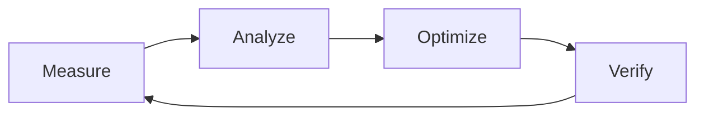

# Optimization Skill - Sistem & Akış Optimizasyonu

> Yazılım sistemlerini ve kullanıcı akışlarını en yüksek performans ve verimliliğe ulaştırma metodolojisi.
> 2025 AI-destekli gözlemlenebilirlik ve sistematik iyileştirme teknikleri.

---

# 📋 İçindekiler

1. [Optimizasyon Prensipleri (2025)](#1-optimizasyon-prensipleri-2025)
2. [Darboğaz Tespiti (Bottleneck Identification)](#2-darboğaz-tespiti-bottleneck-identification)
3. [AI-Driven Optimizasyon](#3-ai-driven-optimizasyon)
4. [Modern Gözlemlenebilirlik (Observability)](#4-modern-gözlemlenebilirlik-observability)
5. [Frontend & Kullanıcı Deneyimi Optimizasyonu](#5-frontend--kullanıcı-deneyimi-optimizasyonu)
6. [Backend & Veritabanı Optimizasyonu](#6-backend--veritabanı-optimizasyonu)
7. [Sistematik İyileştirme Döngüsü](#7-sistematik-iyileştirme-döngüsü)
8. [Kontrol Listesi](#8-kontrol-listesi)
9. [Yapma Listesi](#9-yapma-listesi)
10. [Mutlaka Yap Listesi](#10-mutlaka-yap-listesi)

---

# 1. Optimizasyon Prensipleri (2025)

| Prensip                       | Açıklama                                                                  |
| ----------------------------- | ------------------------------------------------------------------------- |
| **Measurement Over Guessing** | Ölçemediğin şeyi optimize edemezsin.                                      |
| **80/20 Rule (Pareto)**       | Sorunların %80'i, kodun %20'sinden kaynaklanır.                           |
| **Don't Optimize Early**      | Önce çalıştır, sonra doğru çalıştır, en son hızlı çalıştır.               |
| **User-Centric Metrics**      | Sadece teknik hız değil, algılanan hız (perceived performance) önemlidir. |
| **AI-Assisted Analysis**      | Karmaşık veri setlerini analiz etmek için AI araçlarını kullan.           |

---

# 2. Darboğaz Tespiti (Bottleneck Identification)

## 2.1 Sistematik Hata & Yavaşlık Tespiti

Darboğazları tespit etmek için şu adımları izle:

1. **Profiling:** Kodun hangi kısımlarının CPU/Memory tükettiğini belirle.
2. **Tracing:** İsteklerin (request) sistemler arasındaki yolculuğunu izle.
3. **Log Analysis:** Hata ve yavaşlık örüntülerini (patterns) bul.
4. **User Flow Analysis:** Kullanıcının takıldığı veya yavaşladığı "adım"ları tespit et.

## 2.2 Darboğaz İşaretleri

- **CPU Spikes:** Yoğun matematiksel işlem veya sonsuz döngü.
- **Memory Leaks:** Zamanla artan ve düşmeyen bellek kullanımı.
- **High Latency:** Veritabanı sorguları veya dış API bağımlılıkları.
- **Lock Contention:** Çoklu işlemlerde (concurrency) kaynak bekleme süreleri.

---

# 3. AI-Driven Optimizasyon

2025 yılında optimizasyon, manuel analizden AI destekli analize evrilmiştir:

- **AI Profiling:** AI araçlarının kod tabanını inceleyip potansiyel performans sorunlarını önceden tahmin etmesi.
- **Automated Refactoring:** Performans düşüren kod bloklarının AI tarafından "cleaner & faster" versiyonları ile değiştirilmesi.
- **Predictive Scaling:** Gelecekteki yükü tahmin edip altyapıyı önceden hazılaması.

---

# 4. Modern Gözlemlenebilirlik (Observability)

## 4.1 OpenTelemetry ve Full-Stack Visibility

Sistemi sadece "izlemek" (monitoring) yetmez, "anlamak" (observability) gerekir:

- **Metrics:** Zamana dayalı numerik veriler (örn: saniyedeki istek sayısı).
- **Traces:** Tek bir isteğin sistemdeki tüm izi (Microservices/Distributed tracing).
- **Logs:** Detaylı olay kayıtları.

## 4.2 Gözlemlenebilirlik Araçları

- **Prometheus & Grafana:** Metrik görselleştirme.
- **Jaeger/Zipkin:** Distributed tracing.
- **New Relic / Datadog:** Full-stack APM (Application Performance Monitoring).

---

# 5. Frontend & Kullanıcı Deneyimi Optimizasyonu

## 5.1 Core Web Vitals (2025)

- **LCP (Largest Contentful Paint):** En büyük içeriğin yüklenme süresi.
- **INP (Interaction to Next Paint):** Kullanıcı etkileşimine verilen tepki hızı (FID'nin yerini aldı).
- **CLS (Cumulative Layout Shift):** Sayfa düzenindeki kaymalar (göze hoş gelmeyen zıplamalar).

## 5.2 Teknikler

- **Static Replacement:** JavaScript render yerine Server-Side Rendering (SSR) veya Static Site Generation (SSG).
- **Image Optimization:** WebP/AVIF formatları, responsive sizes ve lazy loading.
- **Bundle Splitting:** Kullanılmayan JavaScript'i yüklememe (Tree shaking).

---

# 6. Backend & Veritabanı Optimizasyonu

## 6.1 Database Query Optimization

- **Indexing:** Doğru kolonlara index eklemek sorgu hızını 100x artırabilir.
- **N+1 Avoidance:** Tek tek sorgu atmak yerine "include" veya "join" kullanmak.
- **Query Caching:** Sık değişmeyen verileri Redis gibi memory-store'larda tutmak.

## 6.2 Konvansiyonel Teknikler

- **Connection Pooling:** Veritabanı bağlantılarını açık tutup tekrar kullanmak.
- **Asynchronous Processing:** Zaman alan işleri (e-posta gönderimi vb.) arka plana (background jobs) atmak.

---

# 7. Sistematik İyileştirme Döngüsü

1. **Measure:** Mevcut durumu ölç (Baseline).
2. **Analyze:** Darboğazı ve nedenini bul.
3. **Optimize:** En büyük etkiyi yaratacak değişikliği yap.
4. **Verify:** Değişikliğin performansa etkisini doğrula (Regression test).

---

# 8. Kontrol Listesi

- [ ] Darboğaz teknik verilerle (metrics) doğrulandı mı?
- [ ] Erken optimizasyon (premature optimization) yapılmadığından emin misin?
- [ ] Yapılan değişikliğin rollback planı hazır mı?
- [ ] Değişiklik sonrası "algılanan performans" (perceived performance) ölçüldü mü?
- [ ] Yeni bir darboğaz yaratılmadığı test edildi mi?

---

# 9. Yapma Listesi

❌ Ölçüm yapmadan kodu değiştirme.
❌ Sadece benchmark sonuçlarına bakarak (gerçek kullanıcı verisi olmadan) karar verme.
❌ Tek seferde çok fazla parametreyi optimize etmeye çalışma.
❌ "Daha hızlı" uğruna kod okunabilirliğini (readability) feda etme.

---

# 10. Mutlaka Yap Listesi

✅ 80/20 kuralına odaklan; en çok kullanılan akışları iyileştir.
✅ OpenTelemetry standartlarını kullanarak sistemini şeffaf hale getir.
✅ AI araçlarını veri analizi ve kalıp tespiti (pattern detection) için kullan.
✅ Kullanıcı flow analizleri ile "hissedilen" yavaşlıkları öncelikle gider.
✅ Her optimizasyon sonrası regression testleri çalıştır.

---

**Son Güncelleme:** Aralık 2025
**Versiyon:** 1.0
